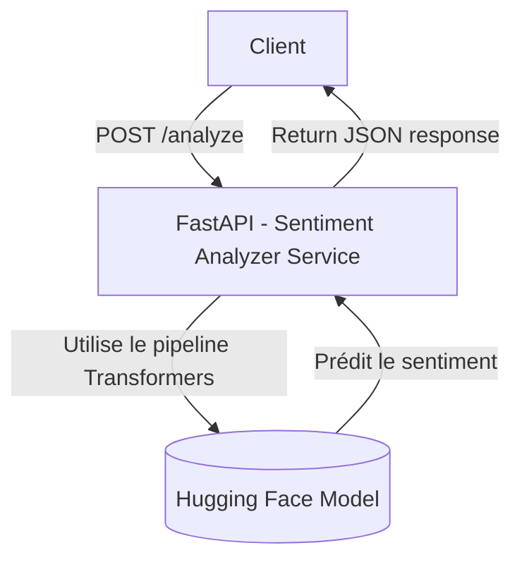
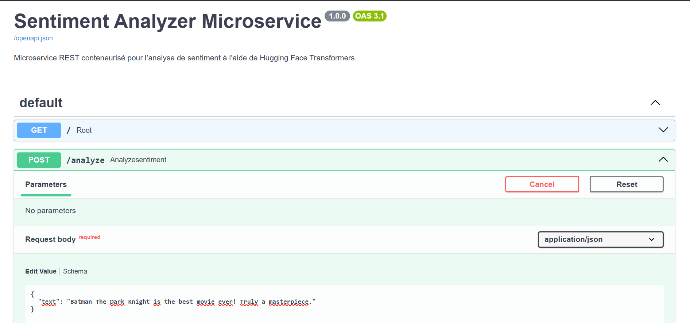
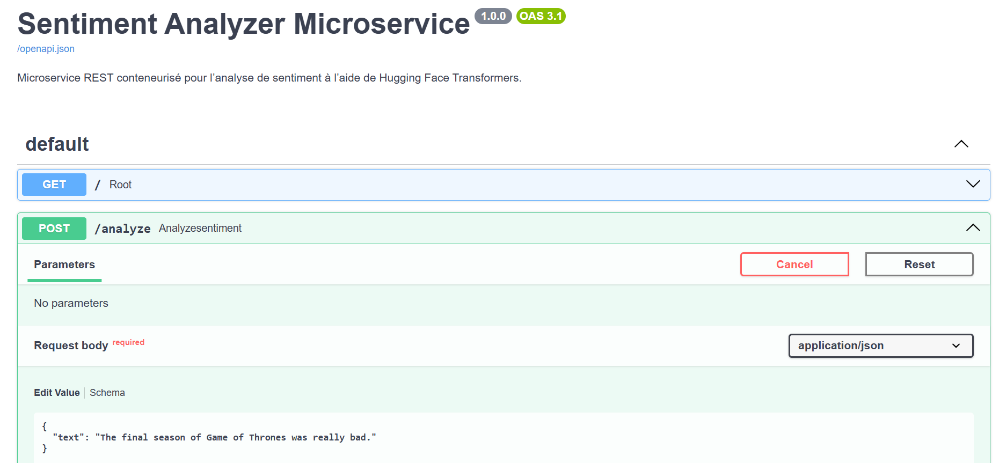
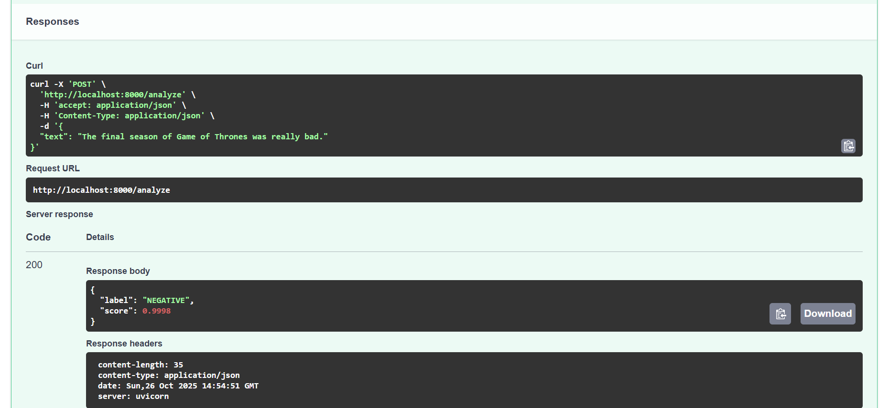

# sentiment-analyzer

Sentiment Analyzer un microservice conteneurisé pour l’analyse de sentiment basé sur **FastAPI**, **Hugging Face Transformers** et **PyTorch**.

## Architecture :



## Fonctionnalités

- Analyse le sentiment d’un texte en anglais (positif / négatif).
- Basé sur le modèle léger `distilbert-base-uncased-finetuned-sst-2-english`.
- API REST simple construite avec **FastAPI**.
- Framework PyTorch (CPU)
- Déployable facilement via **Docker**.

---

## Tech Stack

- **Python**
- **FastAPI**
- **Transformers**
- **PyTorch**
- **Docker**

---

## Lancement avec Docker :

Assurez-vous d’avoir Docker installé, puis :

### Image Docker

- **Lien direct vers l’image sur Docker Hub :** [sentiment-analyzer](https://hub.docker.com/r/mess09/sentiment-analyzer)

- **Taille** : 1.55 GB


### Pull de l’image à partir de Docker Hub

```bash
  docker pull mess09/sentiment-analyzer
```

## Ou cloner le dépôt

**Cloner le dépôt**

```bash
  git clone https://github.com/messaoudRm/sentiment-analyzer.git
  cd sentiment-analyzer
```

**Build l'image Docker**

```bash
  docker build -t sentiment-analyzer .
```

**Lancer le conteneur**:
```bash
  docker run -d -p 8000:8000 sentiment-analyzer
```

---

### Tester l’API :
Accède à la documentation interactive : http://localhost:8000/docs

#### Exemple de text positive



#### Exemple de text negative




